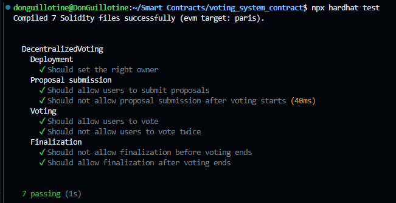

# Decentralized Voting System

A robust, secure, and transparent voting system implemented as a smart contract on the Ethereum blockchain. This project allows users to propose options, vote on them within a specified time frame, and finalize results in a decentralized manner.

## Features

- Proposal submission by users
- Time-bound voting period
- One vote per user
- Real-time voting status
- Vote finalization and winner declaration
- Admin controls for starting/ending voting and pausing the contract
- Deployed and verified on the Lisk Sepolia testnet

## Technologies Used

- Solidity 0.8.24
- Hardhat
- Ethers.js v6
- OpenZeppelin Contracts v5
- Lisk Sepolia Testnet

## Prerequisites

- Node.js (v14.0.0 or later)
- npm (v6.0.0 or later)
- An Ethereum wallet with some Lisk Sepolia ETH for deployment and interaction

## Installation

1. Clone the repository:
   ```
   git clone https://github.com/DonGuillotine/voting-system-contract.git
   cd voting-system-contract
   ```

2. Install dependencies:
   ```
   npm install
   ```

3. Create a `.env` file in the root directory with the following content:
   ```
   LISK_SEPOLIA_RPC_URL=your_rpc.sepolia-api_key
   PRIVATE_KEY=your_private_key
   ETHERSCAN_API_KEY=your_etherscan_api_key
   ```

## Compilation

Compile the smart contracts:

```
npx hardhat compile
```

## Testing

Run the test suite:

```
npx hardhat test
```


#### All tests passed



## Deployment

Deploy the contract to the Lisk Sepolia testnet:

```
npx hardhat run scripts/deploy.js --network lisk-sepolia
```

This script will deploy the contract and automatically verify it on Etherscan.

## Contract Interaction

You can interact with the deployed contract using Hardhat console or by creating a frontend application using Ethers.js.

To use Hardhat console:

```
npx hardhat console --network lisk-sepolia
```

Then you can interact with the contract using JavaScript. For example:

```javascript
const DecentralizedVoting = await ethers.getContractFactory("DecentralizedVoting");
const voting = await DecentralizedVoting.attach("DEPLOYED_CONTRACT_ADDRESS");

// Submit a proposal
await voting.submitProposal("My Proposal");

// Start voting (admin only)
await voting.startVoting(60); // 60 minutes voting period

// Cast a vote
await voting.vote(1); // Vote for proposal with ID 1

// Get voting status
const status = await voting.getVotingStatus();
console.log(status);
```

## Main Functions

- `submitProposal(string memory description)`: Submit a new proposal
- `startVoting(uint256 durationInMinutes)`: Start the voting period (admin only)
- `vote(uint256 proposalId)`: Cast a vote for a specific proposal
- `getProposal(uint256 proposalId)`: Get details of a specific proposal
- `getVotingStatus()`: Get current voting status
- `finalizeVoting()`: End voting and determine the winner (admin only)
- `pause()`: Pause the contract (admin only)
- `unpause()`: Unpause the contract (admin only)

## Security Considerations

- The contract uses OpenZeppelin's AccessControl for role-based access control
- Pausable functionality is implemented for emergency situations
- One vote per address is enforced to prevent double voting
- Time-bound voting period to ensure fairness

## Gas Optimization

- Efficient use of storage variables
- Avoiding unnecessary loops and complex computations

## Future Improvements

- Implement a more sophisticated voting mechanism (e.g., quadratic voting)
- Add delegation functionality
- Create a user-friendly frontend for easier interaction
- Implement upgradability for future enhancements

## Contributing

Contributions are welcome! Please feel free to submit a Pull Request.

## License

This project is licensed under the MIT License - see the [LICENSE](LICENSE) file for details.